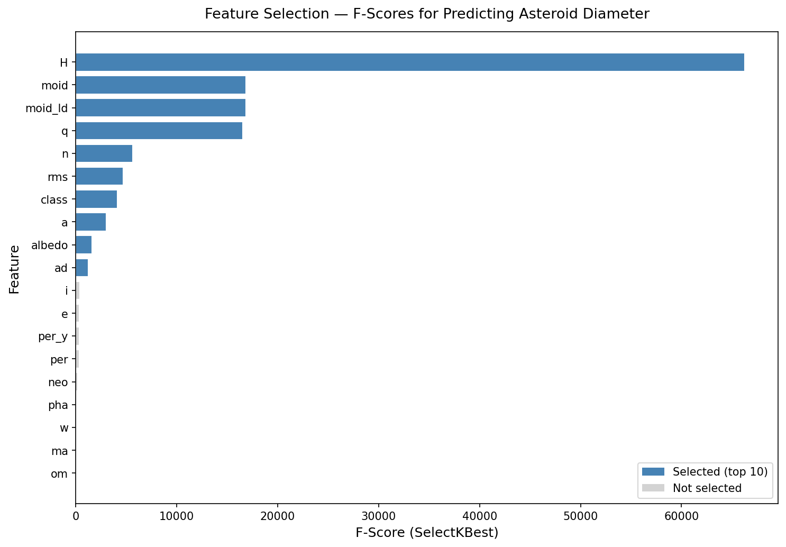
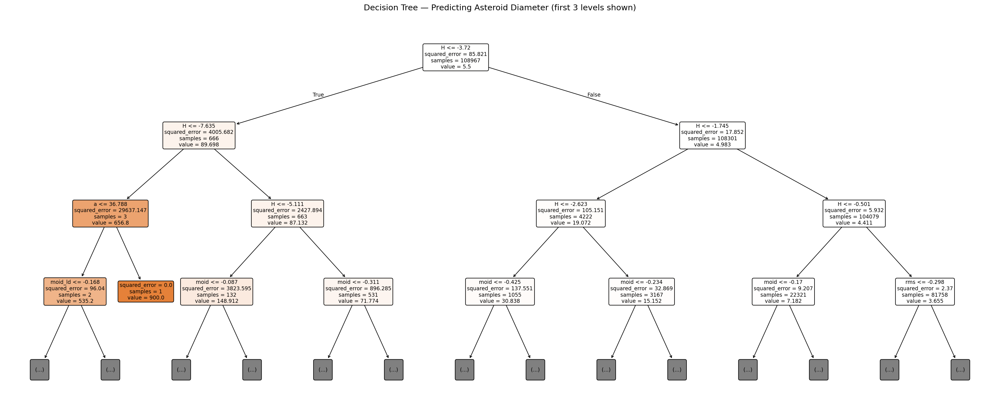

# Question 2 - Asteroid Diameter Prediction (Decision Tree)

This folder contains the notebook, dataset, and result visuals for Question 2.

## Files

- `asteroid_decision_tree.ipynb` - main notebook
- `asteroid.csv` - input dataset
- `feature_selection_scores.png` - feature importance/score plot
- `decision_tree.png` - trained decision tree visualization

## Result Pictures

### 1. Feature Selection Scores

### 2. Decision Tree Visualization

