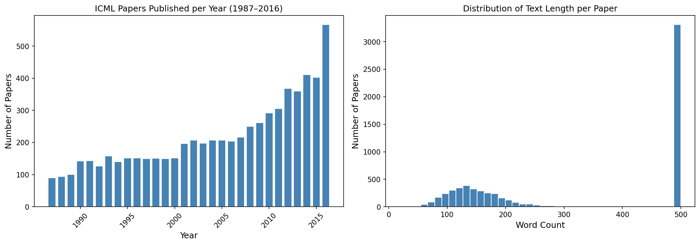
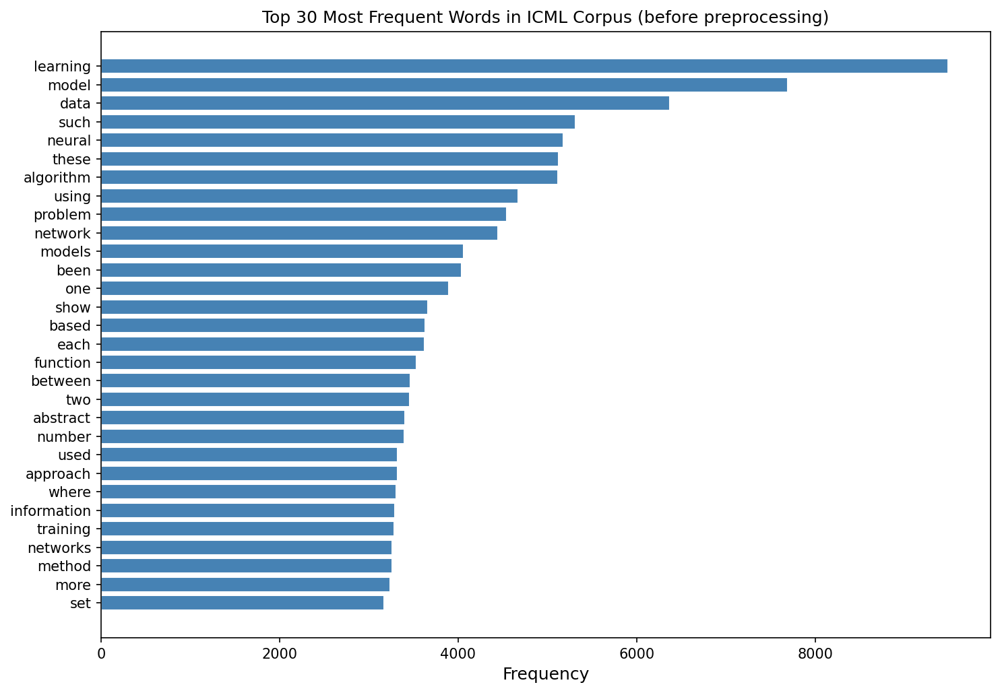
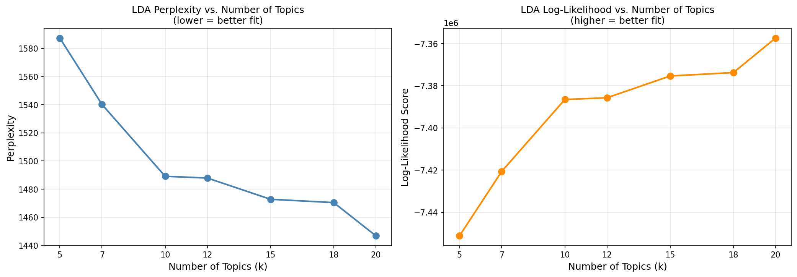
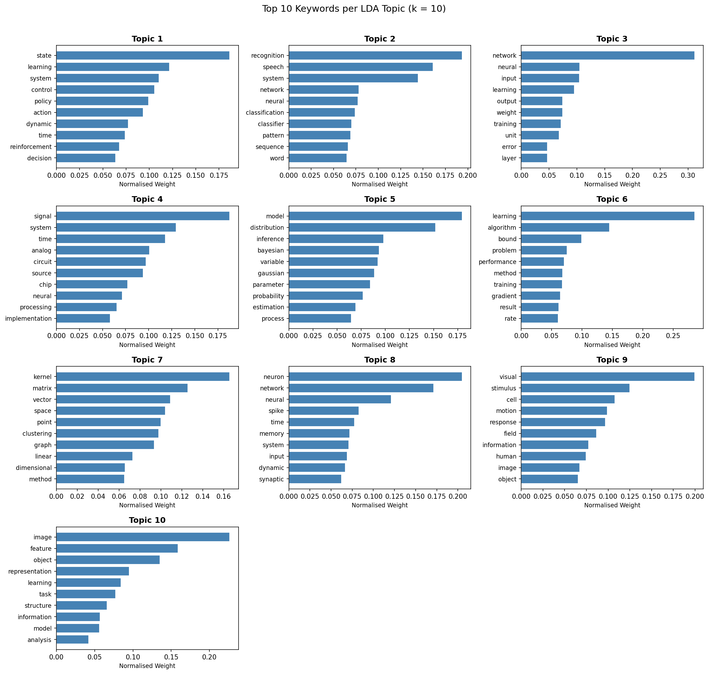
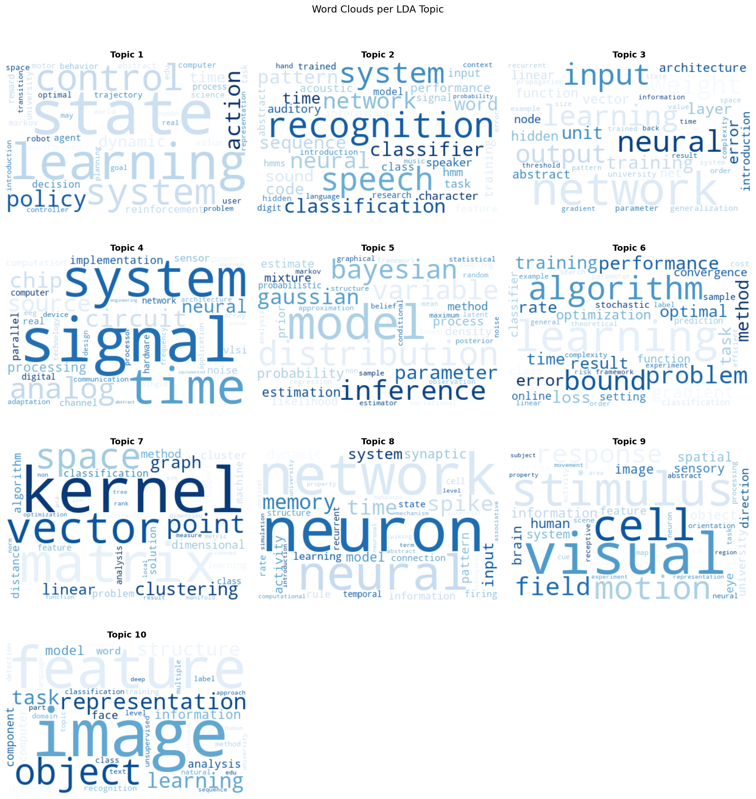
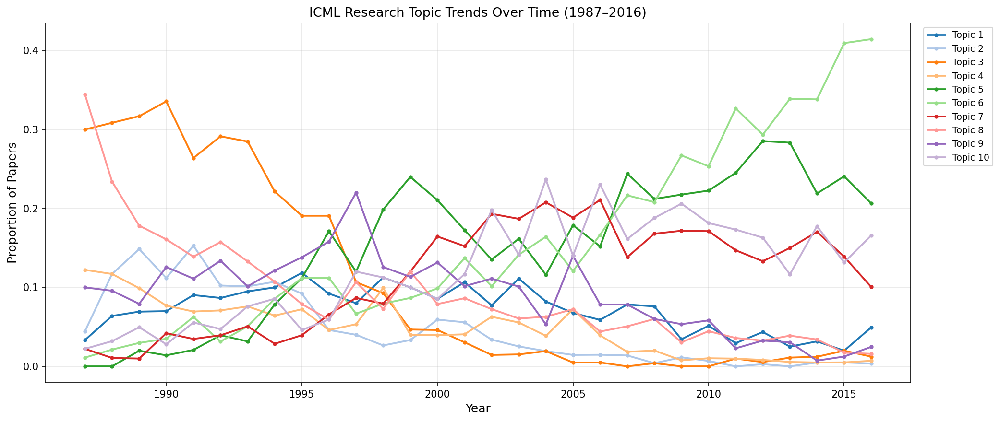
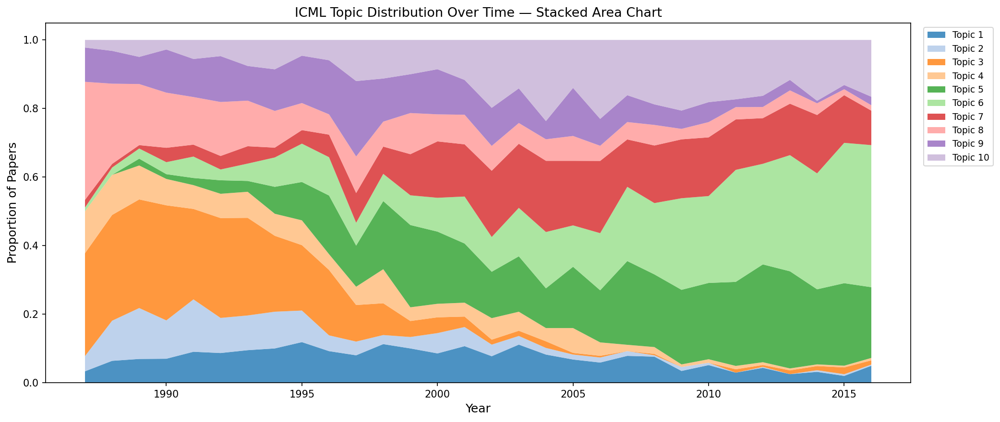
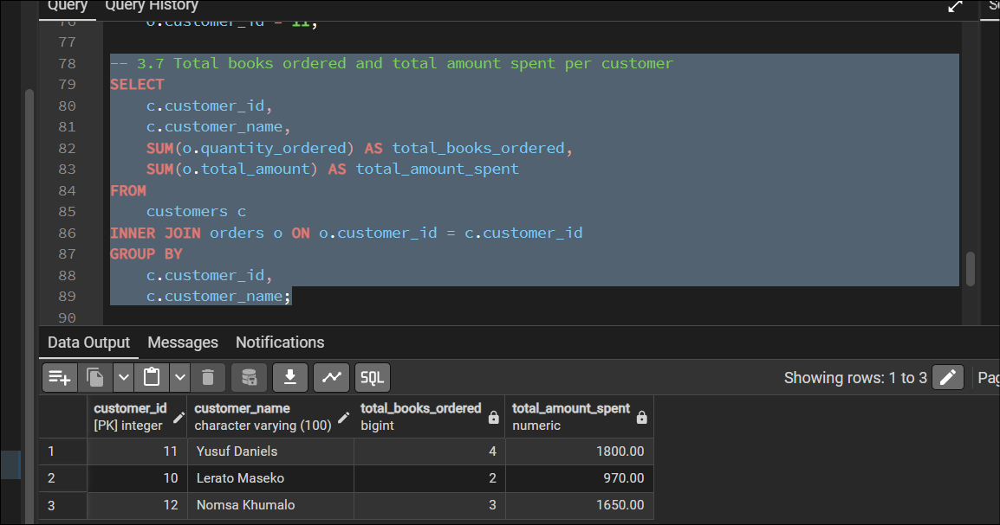
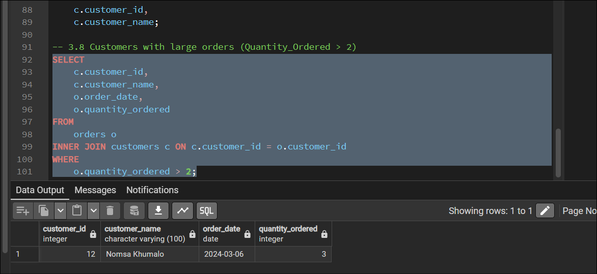

# Project 1

This repo has my answers for all 3 questions in the project.

## What's Inside

```text
project1/
  question-1/
    icml_lda_analysis.ipynb
    lda_topics.html
    dataset/
      articles.csv
  question-2/
    asteroid_decision_tree.ipynb
    project-dataset/
      articles.csv
      asteroid data and description/
        asteroid.csv
  question-3/
    book-store-group-session.sql
```

## Question 1

Main file: `question-1/icml_lda_analysis.ipynb`

Run:
1. Open the notebook.
2. Run all cells from top to bottom.

Results:









## Question 2

Main file: `question-2/asteroid_decision_tree.ipynb`

Run:
1. Open the notebook.
2. Make sure these packages are installed: pandas, numpy, matplotlib, seaborn, scikit-learn.
3. Run all cells from top to bottom.

Results:


## Question 3

Main file: `question-3/book-store-group-session.sql`

Run in PostgreSQL:

```sql
\i 'path/to/project1/question-3/book-store-group-session.sql'
```

Results:





## Author

Thichaona Ketro Sithole
